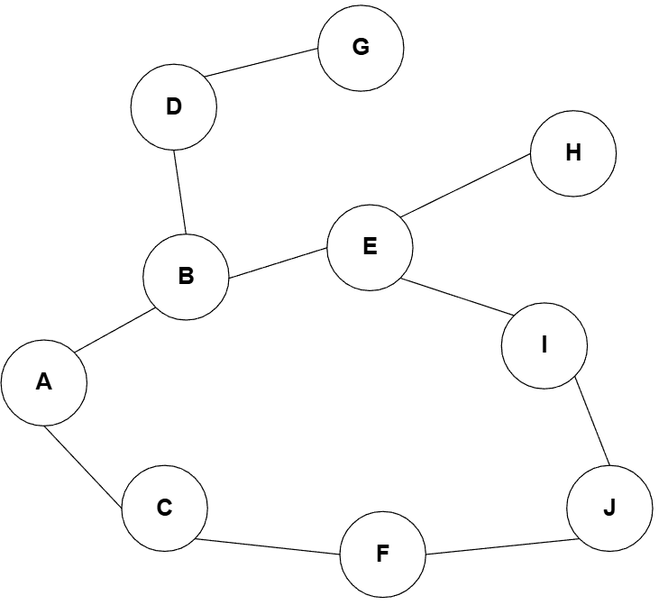

## 1. Grafo.


## 2. Realizar una solucion al problema planteado donde el costo es el mismo entre nodo y nodo.
Se realizan dos soluciones, una utilizando el algoritmo *Breadth First Search* y la otra utilizando *Iterative Deepening Search*, analizando ambos algoritmos encontramos un detalle importante en su ejecucion.

Por ejemplo: 

```sh
$ python3 Red_metro_breadth_first_search.py
Solution path: ['A', 'C', 'F', 'J']
Tiempo: 0.000047 s
Memoria: 4.11KB

$ python3 Red_metro_breadth_first_search.py
Solution path: ['A', 'C', 'F', 'J']
Tiempo: 0.000052 s
Memoria: 4.11KB

$ python3 Red_metro_iterative_deepening_search.py
Solution path: ['A', 'C', 'F', 'J']
Tiempo: 0.000055 s
Memoria: 2.65KB

$ python3 Red_metro_iterative_deepening_search.py
Solution path: ['A', 'C', 'F', 'J']
Tiempo: 0.000056 s
Memoria: 2.65KB
```

Varias ejecuciones del algoritmo *Breadth First Search* nos muestran un tiempo de ejecucion similar y un uso de memoria estable, que comparandolo con el algoritmo *Iterative Deepening Search*, podemos notar que le cuesta un poco mas de tiempo encontrar la solucion, pero reduce considerablemente el uso de la memoria.

Podemos decir que el algoritmo *Breadth First Search*, es una buena opcion si no nos importa el consumo de recursos y queremos encontrar la solucion rapidamente, pero si lo que queremos es optimizar memoria sacrificando un poco el tiempo de ejecucion, es preferible usar *Iterative Deepening Search*.
